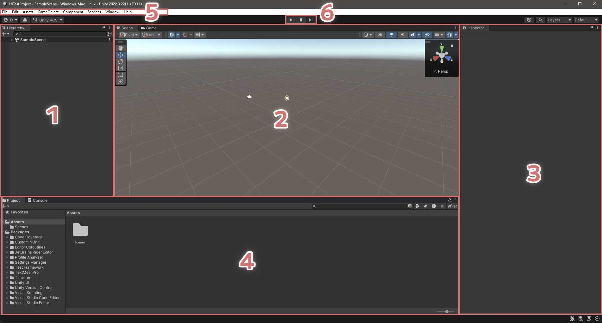
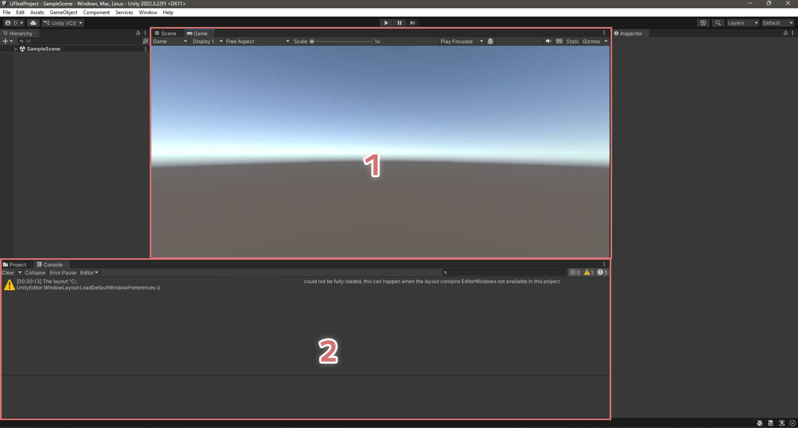

# UnityEditor の見方

UnityEditor は様々なパネルに機能が分かれています。
このパネルごとの呼び方が必須の事前知識となるため、覚えておきましょう。

1. Hierarchy (ヒエラルキー)。Scene (シーン) 上のオブジェクトをリストアップ/選択できます。
2. Scene View (シーンビュー)。Scene を飛び回って確認できます。
3. Inspector (インスペクター)。選択したオブジェクトの情報を確認/編集できます。
4. Project (プロジェクト)。現在の Unity Project に入っているアセットなどをリストアップしています。
5. Menu Bar (メニューバー)。色々な操作ができるメニューです。VRChat SDK等でボタンが追加されたりします。
6. プレイボタン[^1]。Game View (後述) で実際の挙動を確認する際に用います。

また、デフォルトの状態で Scene View と Project のパネルには Game View と Console パネルが格納されています。

1. Game View (ゲームビュー)。プレイモード中に実際にゲームを体験して確認できます。
2. Console (コンソール)。ログやエラーの確認ができます。

[^1]: 実際には Tool Bar 内の UI 要素ですが、その他ボタンを使うことがほぼないので、説明を省略させていただきます。