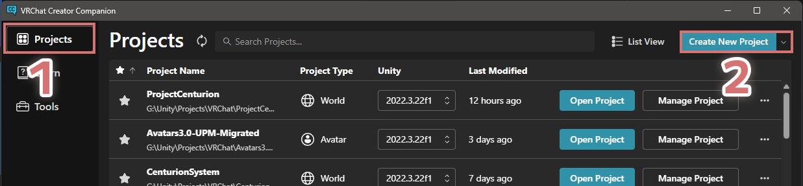
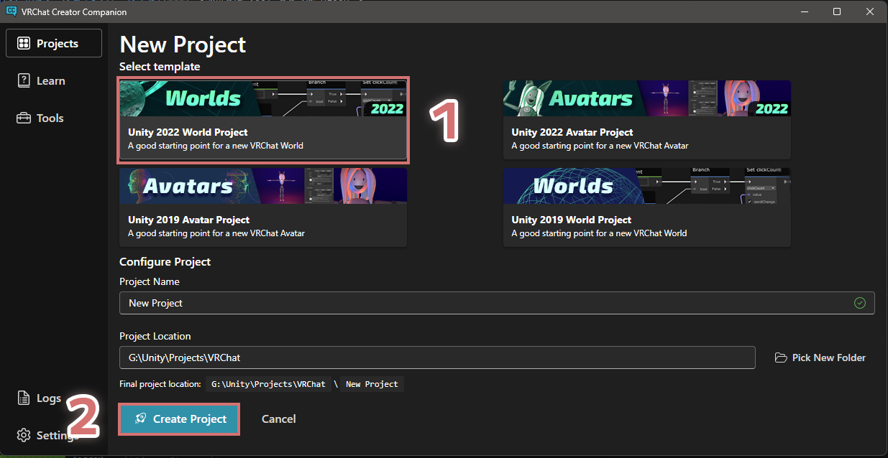

---
sidebar_position: 1
---

# 1. プロジェクトの作成

[0. 前提ツールをインストールする](../../000-get-package-manager/000-get-package-manager.mdx) で取得した VCC, もしくは ALCOM で
VRChat Worlds SDK が入った Template Project を作成します。

Projects タブを開き、Create New Project から新しいプロジェクトを作成します。

テンプレートの中から "Unity 2022 World Project" を選択し、プロジェクト名を決めた上で Create ボタンを押下します。

プロジェクトの作成が完了すると、プロジェクトの管理画面が開かれます。Open Project ボタンを押下し、Unity を起動しましょう!

