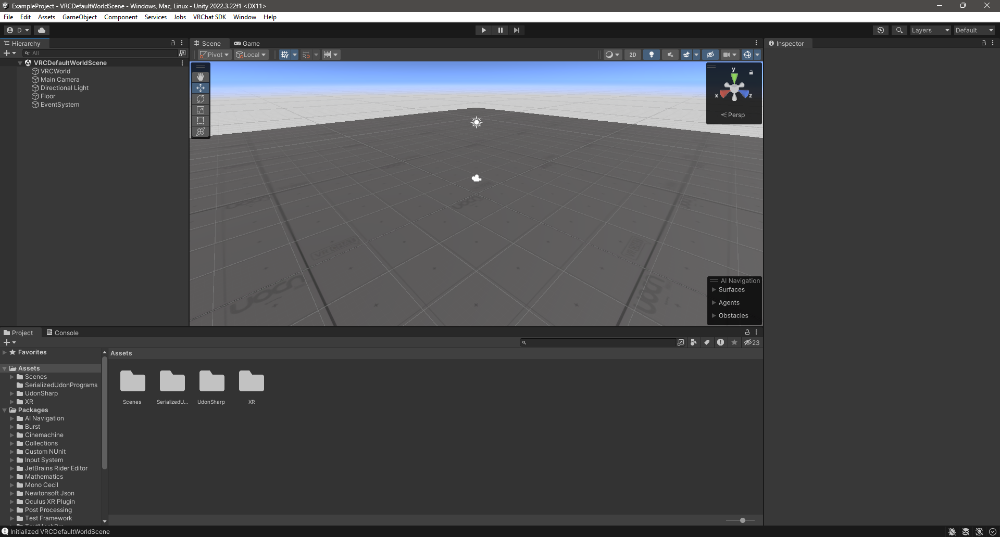
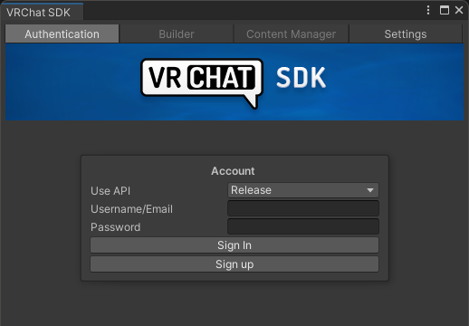
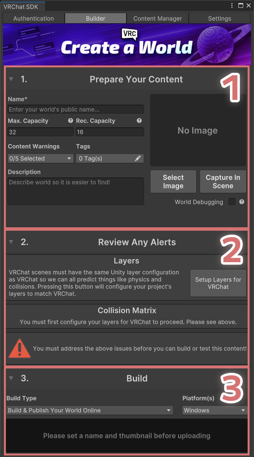
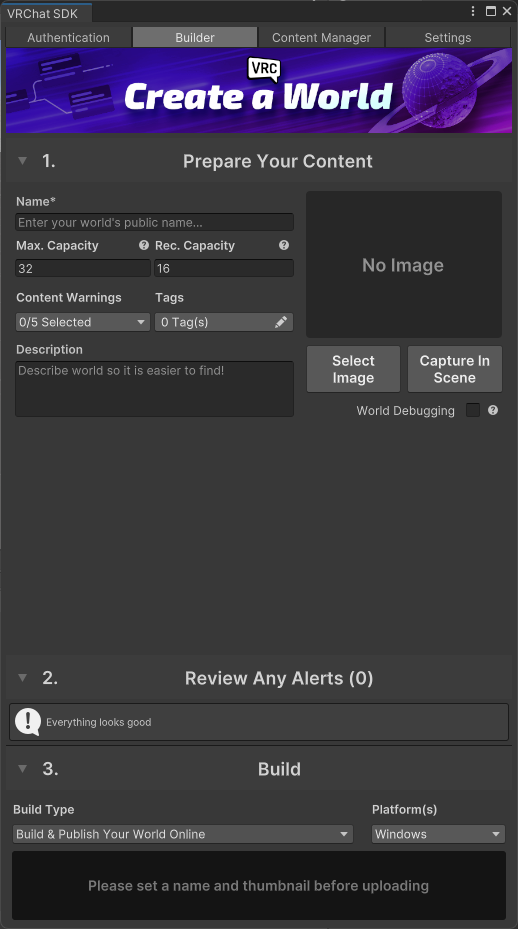

---
sidebar_position: 20
---
# 2. プロジェクトのセットアップ

プロジェクトを開いたら、まずは VRChat SDK のセットアップをします。

最初にプロジェクトを開くと、VRCDefaultWorldScene という名前のシーンを開いた状態で始まります。

まずは、上部メニューバーの VRChat SDK → Show Control Panel からコントロールパネルを開きましょう。

ユーザー名とパスワードを入力し、ログインすると以下の画面に遷移します。

上から順に説明をすると以下のようになります。

1. Prepare Your Content
    - ワールド名やサムネイル、ワールドの最大人数等を設定ができるセクションです。
2. Review Any Alerts
    - 設定ミスがあると警告してくれるセクションです。
3. Build
    - ワールドのアップロードやローカルテストを行えるセクションです。

それでは、2. Review Any Alerts に表示されているボタンを押下し、プロジェクトの設定を完了させましょう。

- Setup Layers for VRChat
    - Unity プロジェクトのレイヤー設定を VRChat 用に変更します。
    - ボタン押下後、ポップアップの "Do it!" を押下で完了です。
- Setup Collision Matrix
    - Unity プロジェクトのコリジョンレイヤー (どのオブジェクトがぶつかり合うか) という設定を VRChat 用に変更します。
    - ボタン押下後、ポップアップの "Do it!" を押下で完了です。

"Everything looks good" の表示になっていればプロジェクトのセットアップは完了です!

