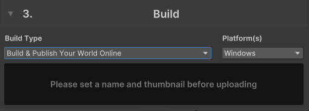
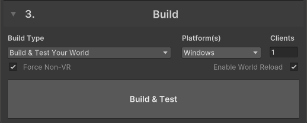

---
sidebar_position: 30
---
# 3. Build & Test で確認する

VRChat SDK の Build & Test 機能を用いてワールドのテストをしてみましょう。

Build Type (Build & Publish Your World Online) となっているところをクリックし、 "Build & Test Your World" を選択します。

すると、以下の表示に切り替わります。

Build & Test を押下するとローカルの VRChat クライアントが起動し、今開いていたシーンを実際に見られます!